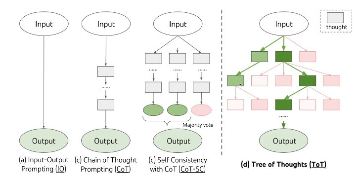

[⬅️ Voltar para o README](./README.md)

# Tree of Thought (ToT)

Tree of Thought (ToT) é uma extensão da técnica Chain of Thought (CoT) que permite que o modelo explore múltiplos caminhos de raciocínio paralelos ou alternativos antes de tomar uma decisão final. Em vez de um raciocínio linear, o ToT incentiva o modelo a **ramificar ideias e avaliar alternativas**, como se estivesse construindo uma árvore de decisões.

## Estudo

A técnica foi formalizada por **Yao et al., 2023**, no paper *Tree of Thoughts: Deliberate Problem Solving with Large Language Models*, mostrando ganhos significativos em tarefas complexas como jogos de lógica, planejamento e raciocínio analítico estruturado.

## Quando utilizar

* A tarefa é ambígua ou tem múltiplas soluções possíveis.
* É necessário comparar estratégias ou caminhos distintos.
* A decisão final depende de múltiplos critérios ou trade-offs.
* Deseja-se simular raciocínio humano deliberado com ponderações.

## Link do paper

:page_facing_up: [Tree of Thoughts: Deliberate Problem Solving with Large Language Models (arXiv)](https://arxiv.org/abs/2305.10601)

## Comparação visual



## Exemplo
**Prompt:**
Você é um engenheiro de software especialista em sistemas distribuídos. Um cliente quer limitar o acesso à sua API que recebe até 100 mil requisições por segundo. **Gere múltiplas abordagens** (caminhos de raciocínio) para resolver esse problema. Para cada abordagem, exponha os prós e contras. Ao final, selecione a mais adequada com base em escalabilidade, confiabilidade e latência.
**Resposta esperada:**
```
**Abordagem 1: Rate Limiting com Token Bucket**
- **Prós:**
  - Simples de implementar e entender.
  - Permite controle granular por cliente.
  - Boa performance em cenários de alta concorrência.
- **Contras:**
  - Pode ser difícil de sincronizar em ambientes distribuídos.
  - Requer armazenamento centralizado (ex: Redis) para estado compartilhado.
**Abordagem 2: Circuit Breaker com Limite de Requisições**
- **Prós:**
  - Protege o sistema de sobrecarga e falhas.
  - Fácil de integrar com middlewares existentes.
  - Permite fallback para respostas pré-definidas.
- **Contras:**
  - Não limita requisições por cliente, apenas globalmente.
  - Pode causar degradação de serviço se mal configurado.
**Abordagem 3: Rate Limiting com Sliding Window**
- **Prós:**
  - Permite controle mais flexível e dinâmico.
  - Pode ser implementado com Redis para sincronização distribuída.
  - Suporta janelas deslizantes para melhor experiência do usuário.
- **Contras:**      
  - Mais complexo de implementar corretamente.
  - Pode introduzir latência adicional se não otimizado.
**Abordagem 4: Sharding de Clientes com Rate Limiting**
- **Prós:**
  - Distribui a carga entre múltiplas instâncias.
  - Permite escalabilidade horizontal.
  - Cada shard pode ter sua própria política de rate limiting.
- **Contras:**
  - Complexidade adicional na gestão de shards.
  - Necessário balanceamento de carga eficiente.
** Avaliação Final:**
Após avaliar as abordagens, a **Abordagem 3 (Sliding Window)** é a mais adequada. Ela oferece um bom equilíbrio entre controle granular, escalabilidade e flexibilidade, permitindo que o sistema suporte picos de requisições sem comprometer a experiência do usuário. A sincronização via Redis garante que o rate limiting funcione corretamente em um ambiente distribuído.
```
# Técnicas auxiliares

**Expansão controlada de caminhos:** limite a profundidade e número de alternativas para evitar dispersão.

> "Apresente no máximo 3 caminhos distintos para resolver este problema e desenvolva até 2 níveis de subetapas para cada um."

**Critérios de decisão explícitos:** guie o modelo com parâmetros como "menor custo", "maior confiabilidade", etc.

> "Para cada abordagem proposta, avalie com base em custo, latência e escalabilidade. Escolha a melhor com base nesses critérios."

**Reavaliação iterativa:** o modelo pode revisar suas escolhas se uma nova ramificação se mostrar superior.

> "Depois de explorar todas as opções, reavalie as decisões com base nos resultados observados em cada caminho e corrija se necessário."


# Combinação com outras técnicas: ToT + CoT + SoT

Tree of Thought é altamente compatível com outras estratégias de prompting, resultando em maior controle, completude e explicabilidade. Abaixo está um exemplo que combina Tree of Thought com Chain of Thought e Skeleton of Thought.

**Prompt combinado (ToT + CoT + SoT):**

Você é um engenheiro de software especialista em sistemas distribuídos. Sua tarefa é projetar uma solução de rate limiting para uma API que suporta 100 mil requisições por segundo. Apresente 3 estratégias distintas, usando o seguinte esqueleto para cada uma:

* Visão geral da abordagem
* **Etapas detalhadas do raciocínio (pense passo a passo, como um engenheiro resolveria isso em produção)**
* Principais vantagens
* Principais desvantagens
* Quando usar essa abordagem

Ao final, escolha a melhor abordagem que represente equilibrio para o problema proposto.

**Resposta esperada (resumo):**
```markdown
**Estratégia 1: Token Bucket com Redis distribuído**

* **Visão geral:** Permite pequenos bursts, boa tolerância à falha.
* **Etapas:** Descrever uso de token bucket, scripts LUA atômicos, cache local.
* **Vantagens:** Popular, flexível, boa documentação.
* **Desvantagens:** Requer Redis de alta disponibilidade.
* **Uso ideal:** Quando se deseja flexibilidade e controle individualizado.

**Estratégia 2: Leaky Bucket com armazenamento local**

* **Visão geral:** Regulariza fluxo de forma constante.
* **Etapas:** Descrever deque local, fallback em caso de falha.
* **Vantagens:** Mais simples, previsível.
* **Desvantagens:** Cache local pode gerar inconsistência.
* **Uso ideal:** Quando a estabilidade do fluxo é mais importante que burst handling.

**Estratégia 3: Sliding Window Log com shard por API key**

* **Visão geral:** Rastreia cada requisição.
* **Etapas:** Uso de logs temporais por cliente.
* **Vantagens:** Alta precisão temporal.
* **Desvantagens:** Alto custo de memória.
* **Uso ideal:** Quando a justiça de tempo real é indispensável.

**Decisão final:** A estratégia 1 oferece o melhor equilíbrio entre performance, controle e robustez para a maioria dos cenários em produção com cargas elevadas.
```

## Comparativo com as outras técnicas
# Comparativo com outras técnicas

| Técnica             | Requer estrutura? | Raciocina passo a passo? | Gera múltiplas alternativas? | Ideal para...                                                 |
| :------------------ | :---------------- | :----------------------- | :-------------------------- | :------------------------------------------------------------ |
| Zero-Shot           | Não               | Não                      | Não                         | Consultas diretas, respostas factuais                         |
| Few-Shot            | Parcial           | Opcional                 | Não                         | Repetir padrões de exemplo com precisão                       |
| Chain of Thought    | Não               | Sim                      | Não                         | Diagnóstico, debugging, raciocínio técnico                     |
| Skeleton of Thought | Sim               | Opcional                 | Não                         | Respostas organizadas, documentações, especificações         |
| Tree of Thought     | Parcial           | Sim                      | Sim                         | Decisão entre estratégias, brainstorming estruturado         |

## Referências e Leitura Recomendada
- [OpenAI Cookbook](https://github.com/openai/openai-cookbook)
- Papers:
  - **Tree of Thoughts: Deliberate Problem Solving with Large Language Models** ([arXiv](https://arxiv.org/abs/2305.10601))

```
